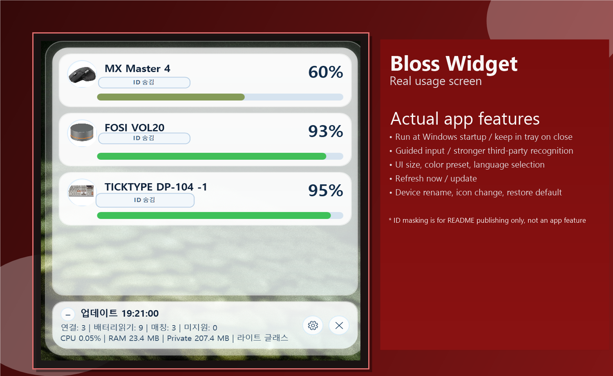

  

<h1 align="center">Bloss</h1>

Bluetooth Battery Indicator for Windows

  <a href="./README.ko.md"><b>KOR</b></a>
  &nbsp;|&nbsp;
  <a href="./README.en.md"><b>ENG</b></a>

  

## Overview
Bloss is a Windows widget app that shows battery levels for Bluetooth-connected devices.

## Preview

  

> This is a real usage capture with device IDs masked only for public README safety.

## How To Use
1. Download the latest `setup.exe` from GitHub Releases and install it.
2. Run Bloss to see battery levels for your connected Bluetooth devices.
3. On the widget display, you can rename devices, change icon images, and restore defaults.

## Key Features
- In settings, click `Update` to run auto-update when a newer release exists.
- After update installation, the widget app closes and starts again automatically.
- Shows Steam Controller 2026 battery in Bluetooth and Puck receiver modes.
- Shows DualSense battery when connected through the supported Pico2W USB bridge path.
- Optimized for desktop widget use with low CPU/RAM overhead.
- Supports launch at Windows startup.
- Supports tray/background running even after closing the main window.
- Supports custom device names and custom device icons.

## Notes
- Third-party game controllers may need extra time before battery data appears.
- Steam Controller charging may show a lower raw value than Steam Client's rounded full-charge display.
- Pico2W support depends on the bridge firmware exposing the expected DualSense USB HID data.
- If status shows `Connecting` or `N/A`, wait a little and try refresh once.
- Some devices may not be supported yet.
