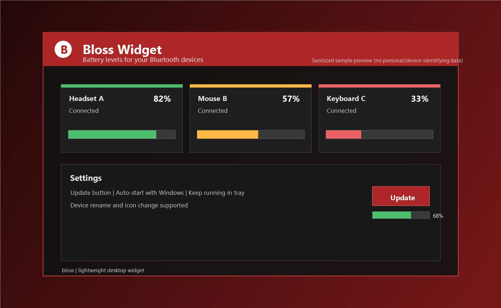

  

<h1 align="center">Bloss</h1>

Windows용 블루투스 배터리 표시 위젯

  <a href="./README.ko.md"><b>KOR</b></a>
  &nbsp;|&nbsp;
  <a href="./README.en.md"><b>ENG</b></a>

## 소개
Bloss는 블루투스로 연결된 전자기기들의 배터리 잔량을 표시해주는 윈도우 위젯 앱입니다.

## 화면 예시

  

> 위 이미지는 개인정보/실기기 정보가 없는 예시 화면입니다.

## 사용 방법
1. GitHub Release에서 최신 `setup.exe`를 내려받아 설치합니다.
2. 앱을 실행하면 연결된 블루투스 기기 배터리 정보가 위젯에 표시됩니다.
3. 표시 화면에서 기기 이름과 아이콘 이미지를 변경할 수 있으며, 기본값 복원도 가능합니다.

## 주요 기능
- 설정창에서 `업데이트`를 누르면 최신 릴리즈가 있을 때 자동 업데이트를 진행합니다.
- 업데이트가 완료되면 위젯 앱이 자동으로 종료되었다가 다시 실행됩니다.
- 데스크톱 위젯 목적에 맞게 CPU/RAM 부담을 낮추도록 최적화했습니다.
- 윈도우 재시작 시 자동 실행 옵션을 제공합니다.
- 앱 창을 닫아도 트레이(백그라운드)에서 계속 실행하는 옵션을 제공합니다.
- 기기 이름 변경과 기기 아이콘 변경을 지원합니다.

## 안내
- 서드파티 게임 컨트롤러는 연결 완료까지 시간이 걸릴 수 있습니다.
- `연결중` 또는 `N/A`로 보이면 최대 5분 정도 기다려 주세요.
- 아직 지원되지 않는 기기가 일부 있을 수 있습니다.
