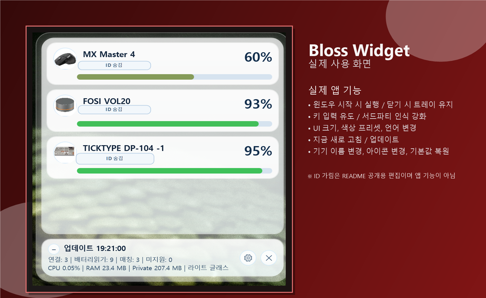

  

<h1 align="center">Bloss</h1>

Windows용 블루투스 배터리 위젯

  <a href="./README.ko.md"><b>KOR</b></a>
  &nbsp;|&nbsp;
  <a href="./README.en.md"><b>ENG</b></a>

  

## 소개
Bloss는 블루투스로 연결된 기기의 배터리 잔량을 데스크톱에서 바로 볼 수 있게 만든 Windows 위젯 앱입니다.

## 화면 예시

  

> 공개용 README 이미지는 개인/기기 식별 정보가 보이지 않도록 가려서 사용합니다.

## 사용 방법
1. GitHub Releases에서 최신 `setup.exe`를 내려받아 설치합니다.
2. 앱을 실행하면 연결된 블루투스 기기의 배터리 정보가 위젯에 표시됩니다.
3. 표시 화면에서 기기 이름 변경, 아이콘 이미지 변경, 기본값 복원을 할 수 있습니다.

## 주요 기능
- 설정창에서 `Update`를 누르면 최신 릴리즈가 있을 때 자동 업데이트를 진행합니다.
- 업데이트가 끝나면 앱이 자동으로 재시작됩니다.
- 데스크톱 위젯 용도에 맞게 CPU/RAM 사용량을 낮추도록 최적화되어 있습니다.
- Windows 시작 시 자동 실행 옵션을 제공합니다.
- 창을 닫아도 트레이(백그라운드)에서 계속 실행할 수 있습니다.
- 기기 이름/아이콘 변경을 지원합니다.

## 안내
- 서드파티 게임 컨트롤러는 연결 후 배터리 표시까지 시간이 조금 걸릴 수 있습니다.
- `연결중` 또는 `N/A`로 보이면 최대 5분 정도 기다려 주세요.
- 일부 기기는 아직 지원되지 않을 수 있습니다.
